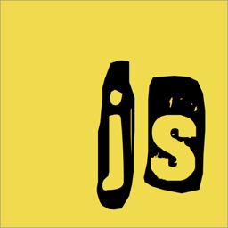

# Punkjs

Punkjs is a [Chrome extension](https://chrome.google.com/webstore/detail/dkjpmglejjkidbgnokkgkiablgbdabpk) that allows you to load local Javascript files into web pages based on the filename. It can load them from a directory of your choosing (like ~/.js) into web pages that match the domain, like google.com.js on www.google.com.

> Punk is the phonetic spelling of the Irish word for dot, "ponc". I wanted to call this "Poncjs", but I also didn't want it to be difficult to search for.

It is the spiritual successor to [dotjs](https://github.com/defunkt/dotjs), which is no longer maintained.

Extensions have security restrictions that stop them reading from the filesystem, so you'll also need to install the [Punkjs Bridge](https://chrome.google.com/webstore/detail/ecnapnimgoienbogbgcmchpgjbgeaobk) App.

## How to Use

* Install the [extension](https://chrome.google.com/webstore/detail/dkjpmglejjkidbgnokkgkiablgbdabpk).
* Install the [app](https://chrome.google.com/webstore/detail/ecnapnimgoienbogbgcmchpgjbgeaobk).
* Create your ~/.js directory.
* Configure the directory by launching the app.
* Hack on some js.

## How it Works

The Punkjs extension and Punkjs Bridge app use the Chrome runtime messaging API for communicating.

Whenever you navigate to a webpage the extension will tell the bridge what domain the page is on. The bridge will try to find matching files, starting with the TLD and working down through the levels (com.js, google.com.js, mail.google.com.js, etc.). The extension then runs the returned Javascript in the context of the page.

## Requirements

* Google Chrome.
